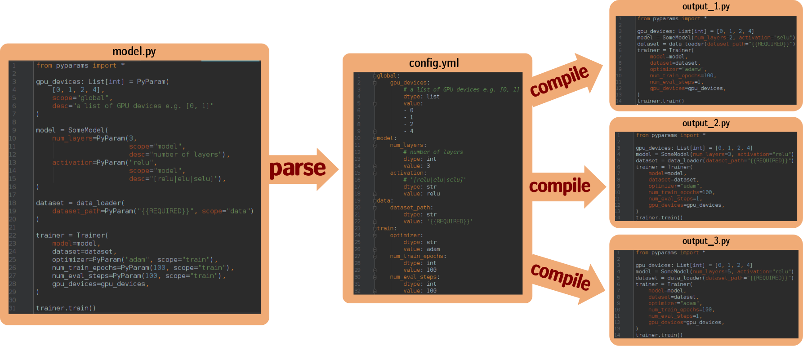

# pyparams
Library for converting any python file parameters into YAML config and
and compilation.



[](https://travis-ci.org/fornaxai/pyparams.svg?branch=master)

# Introduction

PyParams is a python package which uses python
[AST](https://docs.python.org/3/library/ast.html)
library to parametrize python files, parse them and compile.
The idea behind PyParams can be illustrated
with following example. Lets say we have following module `model.py`:

```python
from pyparams import *
@dataclass
class SomeModel:
    num_layers: int = 10
    activation: str = "relu"

    def predict(self, inputs: tf.Tensor) -> tf.Tensor:
        # some logic
        another_param: int = 1
        return outputs

```
We would like to use this module to solve some problem. Lets say there is a
`trainer.py` script which loads this module and
sets parameters of the model and train it.

**First question: how to parametrize this model?**

There are few options:

* we can create argparser for a trainer.py and provide model parameters via
command line e.g:`./trainer.py --num_layers=3`. What if we want to test
another model which will have different set of parameters ?
Should we create another parser ?

* we can create a config.yml which will define a model parameters and provide
this config to trainer.py. However, we will need to create a parser for each model.

* what about other parts like optimizers, augmentations?
They will be parametrized too.  This approach is done in tensorflow detection API,
which uses protobuf to define config file, however writing
parsers/builders will take a lot of time. This is an simple job but tedious...


## PyParams - basics

**PyParams are to solve many of these problems!!!** - however they do it in
a bruteforce manner and probably not elegant. Lets see how we can parametrize
previous example. One must to decorate all parameters with `PyParam` alias.

```python
from wise_models_zoo import *
@dataclass
class SomeModel:
    num_layers: int = PyParam(10, desc="number of layers", scope="general")
    activation: str = PyParam("relu", desc="activation type", scope="general")

    def predict(self, inputs: tf.Tensor) -> tf.Tensor:
        # some logic
        another_param: int = PyParam(1, desc="another param", scope="predict")
        return outputs

```

Note, `PyParam` does actually nothing in the code, if you look at the definition
of `PyParam` object it is just a identity function:

```python
def PyParam(
    value: Any,
    dtype: Optional[type] = None,
    scope: Optional[str] = "",
    desc: Optional[str] = "",
) -> Any:
    return value
```
So, file decorated with `PyParam` is still a valid python file, which can
be used as regular python code! In PyParams, decorated python file
can be considered as a code template which will serve as a read-only
version of some code. This template can be used to create config
file with all pyparams defined in this
template and compiled version of this file, in which all pyparams are
replaced with values from the generated config.

For more examples see codes in: `resources/code_samples/*` with the most
advanced example in `resources/code_samples/template9.py`.

**Warning:** PyParam fields must be defined statically i.e. one cannot
define PyParam fields with another variable. For example this is illegal:

```python
model_scope: str = "scope"  # wrong, cannot be used in PyParams !!!!
num_layers: int = PyParam(10, scope=model_scope)
```


# Simple python example:

1. Define parametrized file by annotating selected parameters with `PyParam`

2. A content of `client.py` file
```python
from pyparams import *

address: str = PyParam("", scope="url")
port: int = PyParam(10000, scope="url")

client = SomeClient(address, port)
# some code here ...
client.do_something()
```

3. Parse file to create `config.yml`:

```bash
pyparams path/to/client.py
cat config.yml
url:
    address:
        dtype: str
        value: ''
    port:
        dtype: int
        value: 10000
```

4. Set config and create compiled version of the `client.py` code.

```bash
pyparams path/to/client.py -o compiled_client.py
``` 
```python
from pyparams import Module
from pyparams import *
address: str = ''
port: int = 10000
client = SomeClient(address, port)
client.do_something()
...
```


# Importing parametrized modules

Modules are suppose to provide reusable parts of the codes.
In order to inform PyParams that selected module should be
interpreted as parametrizable module one most provide special
declaration ("#@") just above `import` statement. In the examples
below we assume that one have prepared a library of different modules
which are located in `modules` folder. The location of the modules
folder may be provided with `-I, --include` parameter of the
pyparam command - see example below. Possible import declarations are:

### #@import_pyparams_as_module(scope)

Named import used with `import as` keyword:
```python
# @import_pyparams_as_module("optimizer")
import modules.optimizers.adam as optimizer_module
```
which in code can be used as a regular python code:
```python
# assuming that optimizer_module has get_optimizer function
optimizer = optimizer_module.get_optimizer(lr)
```
By using named imports one can import the same module multiple times, however
they must differ in `scope` name e.g.:

```python
# @import_pyparams_as_module("right_branch")
import modules.backbones.resnet_v1 as left_branch_module

# @import_pyparams_as_module("left_branch")
import modules.backbones.resnet_v1 as right_branch_module
```
During config compilation PyParams will create
separate variables to control "right_branch" and "left_branch", so we
can have different parameters for left and right branches.

### #@import_pyparams_as_source()

Brute-force module source include, which
works like `#include` declaration in C/C++ languages. For example:

```python
# @import_pyparams_as_source()
from modules.utils_functions import *
```

**Note: Modules are imported in a recursive way, so importing module in module
will work with PyParams.** For example, `utils_functions` file imported may
contain another imports:

```python
# @import_pyparams_as_module()
import modules.train_functions as train_fns_module
# @import_pyparams_as_module("optimizer")
import modules.optimizers.adam as optimizer_module
# @import_pyparams_as_module()
import modules.augmentation.default_augmentation as augmentation_module
```

All parameters included in these imports will appear in final `config.yml` file.


## Importing parametrized modules example:

Lets say we have library of python files which
are parametrized with PyParams. The code for this example
can be found in `resources/examples/modules`. For example our
main.py may look like:

```python
from pyparams import *
from some_ml_lib import ModelTrainer

# @import_pyparams_as_module("model")
import modules.model_v1 as model_module

# @import_pyparams_as_module("optimizer")
import modules.adam as optimizer

trainer = ModelTrainer(
    dataset=PyParam("{{REQUIRED}}", scope="trainer/dataset"),
    model=model_module.get(),
    optimizer=optimizer.get(),
)
trainer.train()
trainer.evaluate()
```

This can be compiled with (assuming that current folder contains imported modules).
See `resources/examples/modules/modules` for the code from this example.

```bash
pyparams main.py -I .

PyParams: Found include module decorator: import modules.model_v1 as model_module
PyParams: Found include module decorator: import modules.adam as optimizer_module
PyParams: importing `modules.model_v1` as `model_module`
PyParams: importing `modules.adam` as `optimizer_module`
[2019-06-02 16:22:18,797][pyparams][INFO][pyparams/main]::Parsing file: main.py
```
The created config may look like this:
```yaml
model:
    num_layers:
        dtype: int
        value: 5
    activation:
        dtype: str
        value: relu
optimizer:
    adam:
        lr:
            dtype: float
            value: 0.01
        beta1:
            dtype: float
            value: 0.9
        beta2:
            dtype: float
            value: 0.995
        epsilon:
            dtype: float
            value: 1.0e-08
trainer:
    dataset:
        dataset:
            dtype: str
            value: '{{REQUIRED}}'
```
Compilation, please check the content of `compiled_main.py` to
see how PyParams deals with importing modules.

```bash
pyparams main.py -I . -o compiled_main.py
```


### Deriving modules

Sometimes we want to try different optimizers, activation function,
resnet blocks etc. Normally, we can parametrize our model with some
`if else` structure e.g.

```python
if activation == "relu":
    act_fn = tf.nn.relu
elif activation == "elu":
    act_fn = tf.nn.elu
else:
    raise ValueError("Unsupported activation function name!")
```

In PyParams we can replace modules in a simple manner. One can derive
template by writing a special file which states which module should be
replaced. Here is how one can derive `main.py` example above
to use different optimizer e.g. `AdamW`.

```python
# the content of main_adamw.py
from pyparams import *
# derive the content of main.py file
DeriveModule("main")
# replace modules.adam with modules.adamw
optimizer_module: Module = ReplaceModule("modules.adamw", "optimizer")
```

Parse file for parameters:

```bash
pyparams main_adamw.py -I .
```


Created `config.yml` will contain `adamw` section instead of `adam`:

```yaml
...
optimizer:
    adamw:
        lr:
            dtype: float
            value: 0.01
        weight_decay:
            dtype: float
            value: 5.0e-06
        beta1:
            dtype: float
            value: 0.9
        beta2:
            dtype: float
            value: 0.995
        epsilon:
            dtype: float
            value: 1.0e-08
...
```

Compilation is done in same way:

```bash
pyparams main_adamw.py -I . -o compiled_main_adamw.py
```

